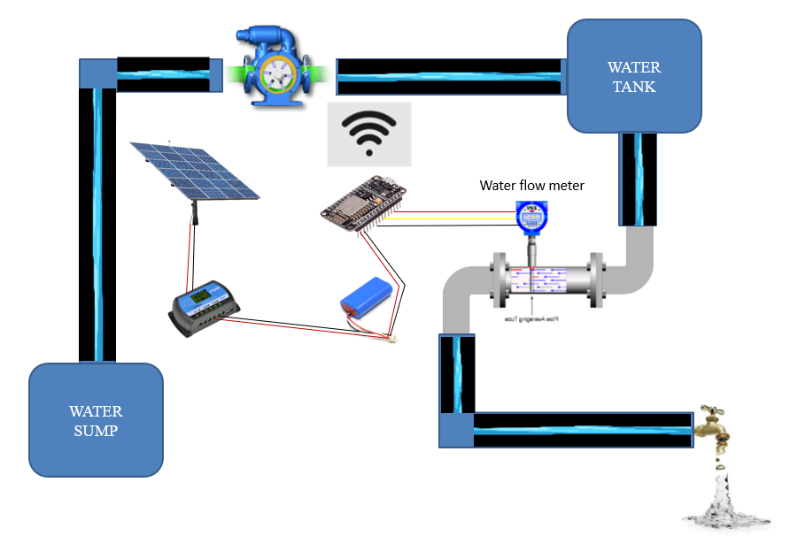
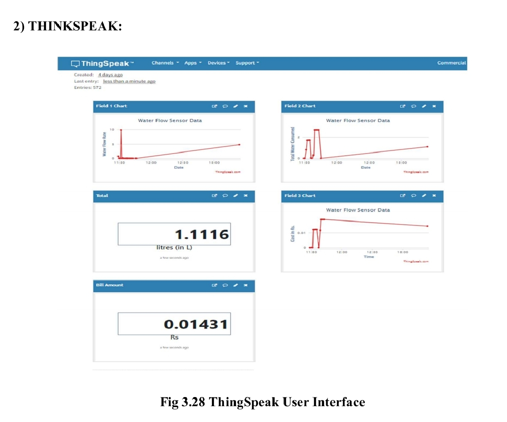

# IoT_Water_meter_using_ESP32💧

A smart water flow monitoring system using ESP32 that measures water consumption, calculates billing costs, and sends data to ThingSpeak for real-time monitoring and visualization.

## 📋 Table of Contents
- [Features](#features)
- [Hardware Requirements](#hardware-requirements)
- [Software Requirements](#software-requirements)
- [Circuit Diagram](#circuit-diagram)
- [Installation](#installation)
- [Configuration](#configuration)
- [Usage](#usage)
- [ThingSpeak Dashboard](#thingspeak-dashboard)
- [Code Structure](#code-structure)
- [Contributing](#contributing)
- [License](#license)

## ✨ Features

- **Real-time Water Flow Monitoring**: Measures water flow rate in L/min
- **Volume Tracking**: Calculates total water consumption in liters and milliliters
- **Cost Calculation**: Automatically calculates water bill based on consumption
- **IoT Connectivity**: Sends data to ThingSpeak cloud platform via WiFi
- **Live Dashboard**: Real-time charts and gauges on ThingSpeak
- **Low Power**: Efficient ESP32-based design
- **Easy Setup**: Simple configuration and deployment

## 🛠️ Hardware Requirements

| Component | Quantity | Description |
|-----------|----------|-------------|
| ESP32 Development Board | 1 | Main microcontroller |
| Water Flow Sensor (YF-S201) | 1 | Hall effect flow sensor |
| Jumper Wires | Several | For connections |
| Breadboard/PCB | 1 | For prototyping |
| Power Supply | 1 | 5V DC adapter |
| Plastic Bottles | 2 | For water reservoir (demo) |
| Tubing | 1m | Clear plastic tubing |
| Water Pump (optional) | 1 | For automated testing |

## 💻 Software Requirements

- **Arduino IDE** (v1.8.0 or higher)
- **ESP32 Board Package** for Arduino IDE
- **Libraries:**
  - WiFi.h (built-in)
  - Wire.h (built-in)
  - ThingSpeak.h

## 📊 Circuit Diagram

```
ESP32 Pinout:
- GPIO 2  → Built-in LED
- GPIO 13 → Water Flow Sensor Signal Pin
- GPIO 25 → Control Pin (Output)
- GPIO 26 → Control Pin (Output)
- VCC     → 5V Power Supply
- GND     → Ground
```

## 🚀 Installation

### 1. Clone the Repository
```bash
git clone https://github.com/Rohith-DR/IoT_Water_meter_using_ESP32.git
cd IoT_Water_meter_using_ESP32
```

### 2. Install Arduino IDE
Download and install Arduino IDE from [arduino.cc](https://www.arduino.cc/en/software)

### 3. Install ESP32 Board Package
1. Open Arduino IDE
2. Go to File → Preferences
3. Add this URL to "Additional Board Manager URLs":
   ```
   https://dl.espressif.com/dl/package_esp32_index.json
   ```
4. Go to Tools → Board → Board Manager
5. Search for "ESP32" and install the package

### 4. Install Required Libraries
1. Go to Sketch → Include Library → Manage Libraries
2. Search and install:
   - **ThingSpeak** by The MathWorks

## ⚙️ Configuration

### 1. ThingSpeak Setup
1. Create a free account at [ThingSpeak.com](https://thingspeak.com/)
2. Create a new channel with 3 fields:
   - Field 1: Flow Rate (L/min)
   - Field 2: Total Volume (L)
   - Field 3: Bill Cost (Rs)
3. Copy your **Write API Key**

### 2. Code Configuration
Update the following parameters in `WaterflowMonitor.ino`:

```cpp
// WiFi Credentials
const char* ssid = "YOUR_WIFI_SSID";
const char* pass = "YOUR_WIFI_PASSWORD";

// ThingSpeak Configuration
const char* myWriteAPIKey = "YOUR_WRITE_API_KEY";
unsigned long myChannelNumber = YOUR_CHANNEL_NUMBER;

// Cost per liter (adjust based on your local rates)
float cost_pmL = 0.007; // Rs per mL
```

## 🔧 Usage

### 1. Hardware Setup
1. Connect the water flow sensor to GPIO 13 of ESP32
2. Connect power and ground connections

### 2. Upload Code
1. Connect ESP32 to your computer via USB
2. Select the correct board and port in Arduino IDE
3. Upload the code to ESP32

### 3. Monitor Data
1. Open Serial Monitor (115200 baud) to see local readings
2. Check your ThingSpeak channel for live data visualization
3. Monitor flow rate, total consumption, and calculated costs

## 📈 ThingSpeak Dashboard

The system automatically sends data to ThingSpeak every 2 seconds, creating real-time visualizations:

- **Field 1 Chart**: Water flow rate over time
- **Field 2 Chart**: Total water consumption
- **Field 3 Chart**: Calculated bill amount
- **Gauges**: Current values display
- **Total Display**: Current total consumption in liters

## 🔍 Code Structure

```
WaterflowMonitor.ino
├── Libraries & Definitions
├── WiFi Configuration
├── ThingSpeak Setup
├── Sensor Calibration
├── Interrupt Handler (pulseCounter)
├── setup()
│   ├── Serial Communication
│   ├── Pin Configuration
│   ├── WiFi Connection
│   └── ThingSpeak Initialization
└── loop()
    ├── Flow Rate Calculation
    ├── Volume Calculation
    ├── Cost Calculation
    ├── ThingSpeak Data Upload
    └── Serial Output
```

## 📊 Key Parameters

- **Calibration Factor**: 2.25 (adjust based on your sensor)
- **Update Interval**: 2000ms (2 seconds)
- **Cost Rate**: ₹0.007 per mL (configurable)
- **Sensor Pin**: GPIO 13 (with pull-up resistor)

## 🛡️ Troubleshooting

### Common Issues:
1. **WiFi Connection Failed**: Check SSID and password
2. **No Sensor Readings**: Verify sensor connections and power
3. **ThingSpeak Upload Failed**: Check API key and internet connection
4. **Inaccurate Readings**: Calibrate the sensor factor

### Debug Steps:
1. Check Serial Monitor for error messages
2. Verify all connections are secure
3. Test with known flow rates for calibration
4. Ensure stable power supply

## 🤝 Contributing

1. Fork the repository
2. Create a feature branch (`git checkout -b feature/AmazingFeature`)
3. Commit your changes (`git commit -m 'Add some AmazingFeature'`)
4. Push to the branch (`git push origin feature/AmazingFeature`)
5. Open a Pull Request

## 📝 Future Enhancements

- [ ] Mobile app integration
- [ ] SMS/Email alerts for high consumption
- [ ] Multiple sensor support
- [ ] Local data logging with SD card
- [ ] Web-based configuration interface
- [ ] Water quality monitoring

## 📄 License

This project is licensed under the MIT License - see the [LICENSE](LICENSE) file for details.

## 📞 Contact

- **Author**: Rohith DR
- **Email**: rohithrohith838@gmail.com
- **Project Link**: https://github.com/Rohith-DR/IoT_Water_meter_using_ESP32

## 🙏 Acknowledgments

- ThingSpeak platform for IoT data visualization
- ESP32 community for excellent documentation
- Arduino IDE for development environment

⭐ **Don't forget to star this repository if you found it helpful!**

## 📸 Project Images

### Physical Setup


### System Architecture


### ThingSpeak Dashboard


---
